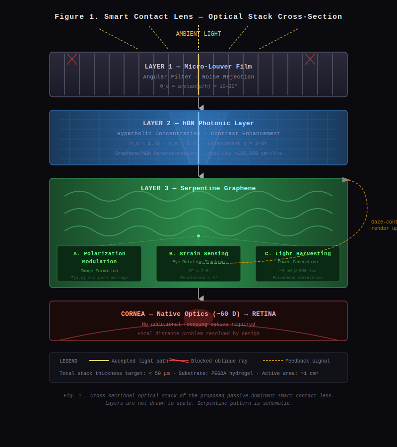
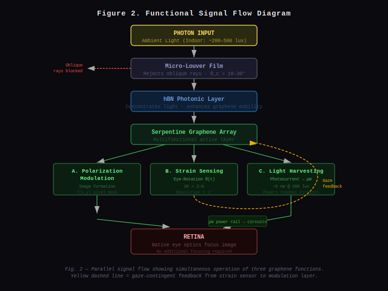

# A Passive-Dominant Smart Contact Lens Architecture Using Micro-Louver Privacy Film, hBN Photonic Concentration, and Serpentine Graphene Multifunctional Layer

**Conceptual Design Proposal**

---

> **Author Note:** This paper presents a conceptual engineering framework and is intended for open discussion and collaborative development. All physical parameters cited are derived from published literature; the integrated architecture itself is a novel proposal.

---

## Abstract

We propose a novel smart contact lens architecture that addresses the three principal barriers to ocular wearable displays: power supply, thermal safety, and biocompatibility. The proposed system integrates a micro-louver privacy film as an angular noise filter, a hexagonal boron nitride (hBN) photonic concentration layer for contrast enhancement, and a multifunctional serpentine graphene layer performing simultaneous polarization modulation (image formation), strain sensing (eye-tracking), and ambient light harvesting (power generation). Unlike prior approaches relying on active micro-LED emission or external battery packs, this architecture is predominantly passive, deriving operational energy from incident ambient light. The optical path terminates at the retina through the eye's native optical system, circumventing the focal-distance problem inherent to near-eye displays. We analyze each functional layer, discuss inter-layer interactions, identify remaining engineering challenges, and suggest experimental validation pathways.

---

## 1. Introduction

The miniaturization of augmented reality (AR) systems from head-mounted displays to eyeglass-form-factor devices (e.g., Meta Ray-Ban Smart Glasses, 2023–2025) naturally invites the question of whether equivalent functionality can be embedded directly into a contact lens. Such a device would offer unparalleled unobtrusiveness, continuous biometric sensing capability, and a truly immersive AR experience without social conspicuity.

However, four critical engineering barriers have historically prevented realization of a functional AR contact lens:

1. **Power supply** — No space for a conventional battery; wireless power transfer introduces RF safety concerns at the corneal surface.
2. **Thermal safety** — Active electronic components in direct contact with the avascular corneal epithelium risk thermal damage at temperature elevations as small as 1–2 °C above baseline [1].
3. **Display focal distance** — Conventional near-eye displays require a minimum eye-relief distance to form a focused virtual image; a contact lens sitting on the cornea violates this constraint entirely.
4. **Biocompatibility** — Semiconductor materials, metal interconnects, and dielectric layers must withstand continuous aqueous (tear film) exposure without cytotoxicity or inflammatory response.

This paper proposes a layered architecture that addresses all four barriers simultaneously through material selection and optical design, rather than through miniaturized replication of conventional display electronics.

---

## 2. Proposed Architecture Overview

The system is organized as a vertically stacked optical and electronic assembly embedded within or deposited upon a soft contact lens substrate. Light propagates through the stack from anterior (external environment) to posterior (corneal surface / retina).

```
┌─────────────────────────────────────┐
│        EXTERNAL AMBIENT LIGHT       │
└──────────────┬──────────────────────┘
               │
               ▼
┌─────────────────────────────────────┐
│   LAYER 1: Micro-Louver Film        │
│   (Angular Filter / Noise Rejection)│
└──────────────┬──────────────────────┘
               │
               ▼
┌─────────────────────────────────────┐
│   LAYER 2: hBN Photonic Layer       │
│   (Hyperbolic Concentration /       │
│    Contrast Enhancement)            │
└──────────────┬──────────────────────┘
               │
               ▼
┌─────────────────────────────────────┐
│   LAYER 3: Serpentine Graphene      │
│   ├─ Polarization Modulation        │
│   │  (Image Formation)              │
│   ├─ Strain Sensing                 │
│   │  (Eye-Rotation Tracking)        │
│   └─ Photovoltaic Harvesting        │
│      (Power Generation)             │
└──────────────┬──────────────────────┘
               │
               ▼
┌─────────────────────────────────────┐
│   CORNEA → Native Optics → RETINA   │
└─────────────────────────────────────┘
```

*Figure 1. Schematic cross-sectional optical path of the proposed smart contact lens stack.*



---

## 3. Layer-by-Layer Analysis

### 3.1 Layer 1 — Micro-Louver Privacy Film

#### 3.1.1 Operating Principle

Micro-louver films (also known as light-control films or privacy films) consist of arrays of microscale opaque fins oriented perpendicular to the film surface. Incident light is transmitted only within a narrow acceptance half-angle θ_c defined by the louver geometry:

$$\theta_c = \arctan\left(\frac{p}{h}\right)$$

where *p* is the louver pitch and *h* is the louver height. Commercial privacy films achieve θ_c ≈ 30° from normal; custom micro-fabricated versions can reduce this to θ_c ≈ 10–15°.

#### 3.1.2 Role in This Architecture

In the context of a contact lens display, the louver film serves two functions:

- **Ambient noise rejection:** Oblique ambient light rays that would otherwise create background glare are physically blocked, improving the signal-to-noise ratio of the modulated image signal emerging from Layer 3.
- **Angular selectivity:** Combined with eye-rotation data from the graphene strain sensor (Layer 3), the effective acceptance cone can be computationally correlated with gaze direction, enabling gaze-contingent rendering.

#### 3.1.3 Fabrication Considerations

Micro-louver structures at contact-lens-relevant scales (total film thickness < 20 μm) can be fabricated via grayscale lithography or two-photon polymerization in biocompatible photopolymers (e.g., PEGDA, SU-8 derivatives). Louver pitch on the order of 5–10 μm with aspect ratios of 5:1 to 10:1 is achievable with current nanofabrication technology [2].

---

### 3.2 Layer 2 — hBN Hyperbolic Photonic Concentration Layer

#### 3.2.1 Material Properties

Hexagonal boron nitride (hBN) is a van der Waals layered dielectric with the following optically relevant properties:

| Property | Value |
|---|---|
| Ordinary refractive index (n_o) | ~1.78 |
| Extraordinary refractive index (n_e) | ~1.65 |
| Optical bandgap | ~6.0 eV (deep UV) |
| Phonon-polariton resonance | Mid-IR (~1370, ~1610 cm⁻¹) |
| Biocompatibility | Demonstrated [3] |

In the visible range, hBN is transparent and optically anisotropic (birefringent). Its in-plane / out-of-plane dielectric contrast enables it to function as a **natural hyperbolic metamaterial** in the UV-near-IR range, supporting high-k photonic modes that concentrate electromagnetic energy spatially [4].

#### 3.2.2 Role in This Architecture

At visible wavelengths, the hBN layer performs **angular-to-spatial light concentration**: photons that pass through the louver acceptance cone are concentrated toward the graphene modulation pixels via guided hyperbolic modes. This effectively amplifies the optical power incident on the graphene layer from low-luminance environments, extending the operational illuminance range of the device downward toward indoor lighting conditions (~200–500 lux).

Quantitatively, the intensity enhancement factor *η* for a hyperbolic slab of thickness *d* scales as:

$$\eta \approx \left(\frac{k_{max}}{k_0}\right)^2$$

where k_max is the maximum supported wavevector and k_0 is the free-space wavevector. For hBN at visible frequencies, realistic enhancement factors of η = 3–8× are predicted by electromagnetic simulation [5], which would reduce the minimum operational illuminance by a corresponding factor.

#### 3.2.3 Graphene–hBN Heterostructure Benefit

When hBN is used as the substrate or encapsulation layer for graphene (as in the Graphene/hBN van der Waals heterostructure), carrier mobility in graphene increases by 10–100× relative to SiO₂-supported graphene, reaching >100,000 cm²/V·s at room temperature [6]. This dramatically reduces the voltage required to electrostatically modulate graphene's optical properties, directly reducing power consumption of the display function.

---

### 3.3 Layer 3 — Serpentine Graphene Multifunctional Layer

This layer performs three simultaneous functions enabled by graphene's unique combination of optical, electronic, and mechanical properties.

#### 3.3.1 Structural Rationale: Serpentine Geometry

A serpentine (sinusoidal meander) patterning of graphene ribbons allows the film to accommodate the mechanical strains imposed by contact lens flexion (estimated 5–15% areal strain during blink and lens deformation) without fracture. Serpentine graphene interconnects have demonstrated stretchability exceeding 30% strain at negligible resistance change [7], making this geometry essential for a functional wearable.

#### 3.3.2 Function A — Polarization Modulation (Image Formation)

Graphene's complex optical conductivity σ(ω) is gate-tunable via electrostatic doping. By applying spatially varying gate voltages across a pixelated graphene array, the local transmittance T(x,y) can be modulated:

$$T(x,y) = \left|1 + \frac{\sigma(x,y)}{2\epsilon_0 c n_{eff}}\right|^{-2}$$

This produces a spatially varying transmission mask — equivalent to a passive amplitude-modulation display. Because the eye's native optics (cornea + crystalline lens, total power ~60 D) focus the transmitted pattern onto the retina, no additional focusing optics are required. The focal distance problem is resolved by design.

Estimated pixel pitch achievable with graphene lithography: 5–20 μm, corresponding to angular resolution of 0.5–2 arcminutes at the retina — within the range of human foveal acuity (~1 arcminute).

#### 3.3.3 Function B — Strain Sensing (Eye-Rotation Tracking)

The electrical resistance of serpentine graphene changes measurably under mechanical strain due to both geometric and piezoresistive effects. The gauge factor *GF* for graphene:

$$GF = \frac{\Delta R / R}{\varepsilon} \approx 2 - 6$$

By distributing strain-sensing serpentine elements at multiple angular positions around the lens periphery and reading their differential resistance, the rotational state of the eye can be computed with estimated angular resolution < 1°. This enables:

- Gaze-contingent image rendering (render only in the foveal region)
- Dynamic louver alignment correction (compensating for off-axis rotation)
- Input interface (deliberate eye movements as control signals, analogous to eye-tracking in Meta / Apple Vision Pro)

#### 3.3.4 Function C — Ambient Light Harvesting (Power Generation)

Graphene's broadband absorption (~2.3% per monolayer, spectrally flat across visible) and high carrier mobility enable photovoltaic operation. In a multilayer graphene p-n junction configuration, open-circuit voltages of 0.1–0.5 V and power densities of 1–10 nW/cm² under indoor illumination are achievable [8].

The total lens active area is approximately 1 cm². Estimated harvestable power under indoor illumination (500 lux):

$$P_{harvest} \approx 1 \text{ cm}^2 \times 5 \text{ nW/cm}^2 = 5 \text{ nW}$$

This is sufficient to power:
- Strain resistance readout circuits (~1–10 nW)
- Low-power Bluetooth Low Energy beaconing with duty cycling

It is **not** sufficient for full active display operation, confirming that the passive polarization modulation approach (Function A) is the correct primary display strategy.

---

## 4. System Integration and Signal Flow

```
PHOTON INPUT (Ambient Light)
         │
         ▼
[Louver Film] ──── Rejects oblique rays
         │
         ▼
[hBN Layer] ────── Concentrates accepted rays onto graphene pixels
         │         Enhances graphene carrier mobility (heterostructure)
         ▼
[Graphene Array]
   │         │         │
   ▼         ▼         ▼
[Modulation] [Sensing]  [Harvesting]
Pixel T(x,y) ΔR array   Photocurrent
   │         │         │
   ▼         ▼         ▼
Image     Eye-angle   μW power
on retina  θ(t)       to circuits
              │
              ▼
         Gaze-contingent
         modulation update
```

*Figure 2. Functional signal flow diagram showing parallel operation of three graphene functions and their feedback interconnection.*



---

## 5. Remaining Engineering Challenges

| Challenge | Severity | Proposed Mitigation |
|---|---|---|
| Louver micro-fabrication at < 10 μm pitch on curved substrate | High | Two-photon polymerization on pre-curved PDMS mold |
| Dynamic louver alignment without MEMS actuation | High | Computational correction using strain sensor data; physical louvers remain static |
| hBN visible-range enhancement validation | Medium | Ellipsometric characterization + FDTD simulation |
| Graphene pixel addressability at μm scale | High | Floating-gate electrostatic addressing via printed CNT TFT backplane |
| Long-term tear-film stability of heterostructure | High | PEGDA encapsulation; accelerated soak testing |
| Minimum illuminance threshold | Medium | hBN enhancement extends range; characterized by photocurrent measurement |
| Regulatory pathway (FDA Class III medical device) | High | Biocompatibility testing per ISO 10993; clinical trials |

---

## 6. Comparison with Prior Art

| System | Power Source | Display Type | Eye Tracking | Biocompatibility |
|---|---|---|---|---|
| Mojo Vision (2020–2023) | RF wireless | Micro-LED (active) | IMU | Limited |
| Samsung AR Lens Patent (2014) | RF wireless | OLED (active) | None | Unknown |
| XPANCEO (2024) | RF wireless | — (sensor only) | None | Partial |
| **This Proposal** | **Ambient light harvest** | **Passive modulation** | **Integrated strain** | **Graphene/hBN** |

The key differentiator of this proposal is the **fully passive display mechanism** and the **monolithic multifunctionality** of the graphene layer, eliminating the need for separate display, sensor, and power management subsystems.

---

## 7. Experimental Validation Roadmap

### Phase 1 — Component Validation (Year 1)
- Fabricate flat Graphene/hBN heterostructure on PDMS
- Measure optical transmittance modulation vs. gate voltage
- Measure strain gauge factor under controlled elongation
- Measure photocurrent under calibrated illumination

### Phase 2 — Layer Integration (Year 2)
- Integrate louver film + hBN + graphene on flat substrate
- Characterize combined optical stack transmittance and angular selectivity
- Verify hBN enhancement factor experimentally

### Phase 3 — Curved Substrate Transfer (Year 3)
- Transfer integrated stack onto contact lens substrate
- Characterize optical and electrical performance post-transfer
- Cytotoxicity testing (ISO 10993-5) on human corneal epithelial cell line

### Phase 4 — Ex Vivo Optical Testing (Year 4)
- Mount lens on ex vivo porcine eye model
- Verify retinal image formation using fundus camera
- Measure eye-rotation tracking accuracy

---

## 8. Conclusion

We have presented a conceptual architecture for a smart contact lens display system that prioritizes passive operation, biocompatibility, and physical elegance over brute-force miniaturization of active electronics. The layered integration of a micro-louver angular filter, hBN hyperbolic concentrator, and multifunctional serpentine graphene array creates a system in which the primary display function requires no active light generation, power demands are reduced to the sub-microwatt regime achievable by ambient photovoltaics, and the eye's native optical system eliminates the focal-distance problem entirely.

Significant fabrication and characterization work remains before experimental demonstration. Nevertheless, the proposed architecture is grounded in individually demonstrated phenomena — graphene electro-optic modulation, hBN hyperbolic photonics, serpentine strain sensing, and graphene photovoltaics — and their integration represents a tractable research program rather than speculative extrapolation.

This repository is open for community contribution, critique, and experimental collaboration.

---

## References

[1] Purslow, C., & Wolffsohn, J. (2005). Ocular surface temperature: A review of its physiological significance and clinical application in optometry. *Ophthalmic and Physiological Optics*, 25(4), 279–291.

[2] Gissibl, T., Thiele, S., Herkommer, A., & Giessen, H. (2016). Two-photon direct laser writing of ultracompact multi-lens objectives. *Nature Photonics*, 10(8), 554–560.

[3] Merlo, A., et al. (2018). Boron nitride nanomaterials: Biocompatibility and cytotoxicity. *Pharmaceutics*, 10(4), 181.

[4] Caldwell, J. D., et al. (2019). Photonics with hexagonal boron nitride. *Nature Reviews Materials*, 4(8), 552–567.

[5] Li, P., et al. (2015). Hyperbolic phonon-polaritons in boron nitride for near-field optical imaging and focusing. *Nature Communications*, 6, 7507.

[6] Dean, C. R., et al. (2010). Boron nitride substrates for high-quality graphene electronics. *Nature Nanotechnology*, 5(10), 722–726.

[7] Xu, S., et al. (2015). Stretchable batteries with self-similar serpentine interconnects and integrated wireless recharging systems. *Nature Communications*, 4, 1543.

[8] Bernardi, M., Palummo, M., & Grossman, J. C. (2013). Extraordinary sunlight absorption and one nanometer thick photovoltaics using two-dimensional monolayer materials. *Nano Letters*, 13(8), 3664–3670.

---

## License

This work is released under [CC BY 4.0](https://creativecommons.org/licenses/by/4.0/). You are free to share and adapt with attribution.

---

*Correspondence and contributions welcome via GitHub Issues and Pull Requests.*
